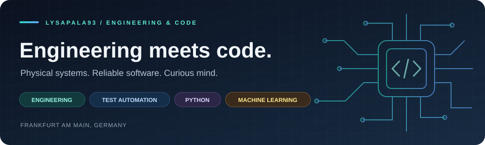
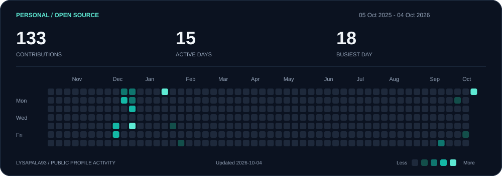

  

<h3 align="center">Mechanical &amp; process engineer → embedded firmware tester → Python developer</h3>

---

### About me

- 🎓 **M.Sc. in mechanical and process engineering** — taught me to break down complex problems, work precisely, and stay analytical when things get messy. Also taught me that nothing is ever *just* a simple pipe.
- 🔌 I work as an **embedded firmware tester**, validating software that runs directly on hardware.
- 🐍 I'm a **Python developer** and use Python **professionally every day** — for test automation, tooling and interfaces that control embedded devices.
- 🤖 I'm diving into **machine learning**, currently working my way towards **reinforcement learning**.
- 🧪 Favourite mix: real physical systems + reliable, automated software.

### What I work with

  
  &nbsp;
  
  &nbsp;&nbsp;
  
  &nbsp;&nbsp;
  

Python · C++ · Shell · pytest · pySerial · NumPy · pandas · PyTorch · scikit-learn · Docker · Git · GitHub Actions · Linux

### Current project

🃏 **[blackjack-engine](https://github.com/lysapala93/blackjack-engine)** — a Python Blackjack simulation engine built as an explicit phase state machine. No blocking `input()`, no hidden game loop: just a small synchronous API, so the same engine can be driven by a human in the terminal or by a scripted / reinforcement-learning agent. Fully covered by pytest — and the foundation for the RL agent I want to train on it.

### Also right now

- 🔭 Writing Python interfaces that talk to embedded devices, so hardware can be driven and tested straight from a script instead of by hand.
- 🌱 Learning machine learning because it genuinely fascinates me — my current goal is a **reinforcement learning agent that plays Blackjack**, which is exactly why the engine above exists.
- 💬 Happy to talk about test automation, embedded quality, or getting started with Python.

### My GitHub activity

  

The dashboard above is generated from my public contributions and refreshed daily by a GitHub Actions workflow.
